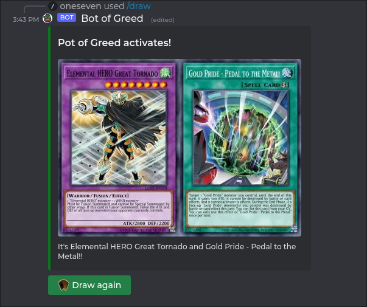
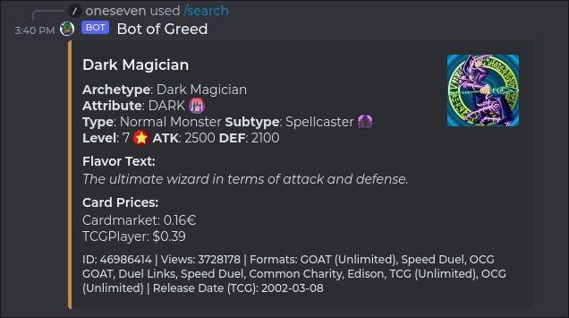
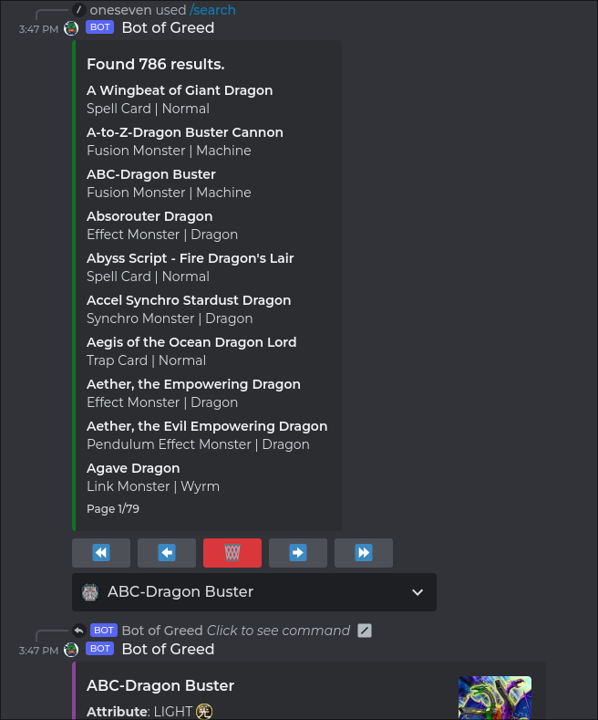
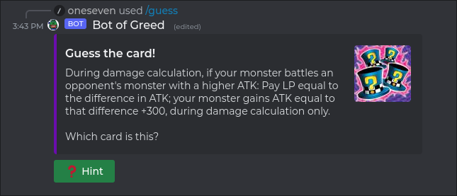

# Bot of Greed


**Bot of Greed** is a Discord bot, made in Python with the Disnake API wrapper, that uses the YGOProDeck API to populate a database and display information about Yu-Gi-Oh cards in various ways. Took way too long to finish this, mostly because of university and being too greedy (ironic) in the features I wanted to include.

## Installation

Download the source code as a .zip file or use git to clone the remote repository.

```
git clone https://github.com/pedrosilva17/bot-of-greed.git
```

## Usage

Just typing a slash "/" in a text channel will reveal all the available commands. A short description is available for each one, as well as a specific one (/guide) that provides you with a more detailed explanation regarding certain commands.

Some documentation is still missing, but I'll complete it (eventually).

## Screenshots

### Draw two cards


### Search embeds




### Card guessing game



## Contributing
Please report any problems you have using the Issues tab on GitHub. Any spaghetti code you might find (there's plenty) and have enough patience to fix, or improvements that could be done, go ahead and make a pull request, thank you for your help!
## License
[MIT](https://choosealicense.com/licenses/mit/)

### A note about card artworks
This bot will probably be hosted on a local computer for the time being. Card images are not on this repository, I do not own them. There's a message inside the artworks folder talking about card artworks as and what you can do to easily download the images yourself.

